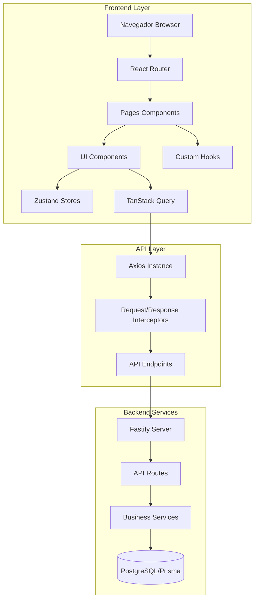

# Plano de Arquitetura do Frontend - SimpleXR DAM 3D

## Sumário Executivo

Este documento detalha o plano abrangente para desenvolvimento e modernização do frontend do SimpleXR Headless CMS 3D. O objetivo é criar uma interface administrativa moderna, responsiva, acessível e performática que se integre perfeitamente com os serviços de backend existentes.

---

## 1. Análise do Estado Atual

### 1.1 Tecnologias Identificadas

| Categoria | Tecnologia | Versão | Propósito |
|-----------|------------|--------|-----------|
| Runtime | Node.js | - | Ambiente de execução |
| Framework | React | 18.3.1 | Interface de usuário |
| Build Tool | Vite | 6.0.3 | Build e desenvolvimento |
| Linguagem | TypeScript | 5.7.2 | Tipagem estática |
| Routing | React Router DOM | 7.1.1 | Navegação |
| State Management (Server) | TanStack Query | 5.62.11 | Cache e sincronização server state |
| State Management (Client) | Zustand | 5.0.2 | Client state |
| Forms | React Hook Form | 7.54.2 | Gerenciamento de formulários |
| Validation | Zod | 3.24.1 | Validação de schemas |
| 3D Rendering | React Three Fiber | 8.17.10 | Renderização 3D |
| 3D Utilities | React Three Drei | 9.117.3 | Componentes 3D |
| 3D Core | Three.js | 0.171.0 | Core 3D |
| Styling | Tailwind CSS | 3.4.17 | CSS utility-first |
| Icons | Lucide React | 0.468.0 | Ícones |
| Utilities | clsx, tailwind-merge | 2.6.0, 2.1.1 | Class manipulation |

### 1.2 Estrutura de Pastas Atual

```
admin/src/
├── components/
│   ├── Layout/
│   │   ├── Header.tsx
│   │   ├── Sidebar.tsx
│   │   ├── MainLayout.tsx
│   │   └── index.ts
│   ├── ui/
│   │   ├── Button.tsx
│   │   ├── Card.tsx
│   │   ├── Input.tsx
│   │   ├── Select.tsx
│   │   ├── Dialog.tsx
│   │   ├── Toast.tsx
│   │   ├── Badge.tsx
│   │   └── index.ts
│   ├── AssetCard.tsx
│   ├── AssetGrid.tsx
│   ├── ModelViewer.tsx
│   └── StatusBadge.tsx
├── pages/
│   ├── Dashboard.tsx
│   ├── Assets.tsx
│   ├── AssetDetail.tsx
│   ├── AssetForm.tsx (incompleto)
│   ├── Lighting.tsx
│   ├── Renders.tsx
│   └── Uploads.tsx
├── lib/
│   ├── api.ts
│   ├── store.ts
│   ├── types.ts
│   └── utils.ts
├── styles/
│   └── globals.css
├── App.tsx
└── main.tsx
```

### 1.3 Endpoints de API Identificados

#### Assets
- `GET /assets` - Lista assets com filtros
- `GET /assets/:id` - Detalhes de um asset
- `POST /assets` - Criar asset
- `PATCH /assets/:id` - Atualizar asset
- `DELETE /assets/:id` - Excluir asset

#### Lighting Presets
- `GET /presets/lighting` - Lista presets de iluminação
- `POST /presets/lighting` - Criar preset
- `PATCH /presets/lighting/:id` - Atualizar preset
- `DELETE /presets/lighting/:id` - Excluir preset

#### Render Presets
- `GET /presets/render` - Lista presets de renderização
- `POST /presets/render` - Criar preset
- `DELETE /presets/render/:id` - Excluir preset

#### Variants
- `GET /variants` - Lista variantes de materiais
- `POST /variants` - Criar variante
- `GET /variants/:id` - Detalhes de variante
- `PATCH /variants/:id` - Atualizar variante

#### Uploads
- `POST /uploads/presign` - Presigned URL para upload

### 1.4 Modelos de Dados Principais

```typescript
// Asset3D - Entidade principal
interface Asset3D {
  id: string;
  name: string;
  masterUrl: string;
  status: 'draft' | 'processing' | 'ready' | 'failed';
  createdAt: string;
  updatedAt: string;
  thumbnails?: Record<string, AssetThumbnail>;
  fileSize?: number;
  tags?: string[];
  description?: string;
}

// LightingPreset - Preset de iluminação
interface LightingPreset {
  id: string;
  name: string;
  hdriUrl: string;
  exposure: number;
  intensity: number;
  tags: string[];
  createdAt: string;
  updatedAt: string;
}

// RenderPreset - Preset de renderização
interface RenderPreset {
  id: string;
  assetId: string;
  lightingPresetId: string;
  camera: {
    fov: number;
    position: [number, number, number];
    target: [number, number, number];
  };
  createdAt: string;
  updatedAt: string;
  assetName?: string;
  lightingPresetName?: string;
}
```

---

## 2. Arquitetura Proposta

### 2.1 Diagrama de Arquitetura



### 2.2 Estrutura de Pastas Proposta

```
admin/src/
├── components/
│   ├── Layout/
│   │   ├── Sidebar.tsx
│   │   ├── Header.tsx
│   │   ├── MainLayout.tsx
│   │   ├── Breadcrumbs.tsx
│   │   └── index.ts
│   ├── ui/
│   │   ├── Button.tsx
│   │   ├── Card.tsx
│   │   ├── Input.tsx
│   │   ├── Select.tsx
│   │   ├── Dialog.tsx
│   │   ├── Toast.tsx
│   │   ├── Badge.tsx
│   │   ├── Table.tsx
│   │   ├── Modal.tsx
│   │   ├── Skeleton.tsx
│   │   ├── Spinner.tsx
│   │   ├── EmptyState.tsx
│   │   ├── Tabs.tsx
│   │   ├── Dropdown.tsx
│   │   ├── Tooltip.tsx
│   │   ├── Alert.tsx
│   │   ├── Pagination.tsx
│   │   ├── Avatar.tsx
│   │   ├── Progress.tsx
│   │   ├── Switch.tsx
│   │   ├── Checkbox.tsx
│   │   ├── Radio.tsx
│   │   ├── Textarea.tsx
│   │   ├── Label.tsx
│   │   ├── FormField.tsx
│   │   ├── index.ts
│   │   └── index.tsx
│   ├── common/
│   │   ├── PageHeader.tsx
│   │   ├── FilterBar.tsx
│   │   ├── SearchInput.tsx
│   │   └── ActionButtons.tsx
│   ├── assets/
│   │   ├── AssetCard.tsx
│   │   ├── AssetGrid.tsx
│   │   ├── AssetTable.tsx
│   │   ├── AssetFilters.tsx
│   │   ├── AssetUpload.tsx
│   │   └── index.ts
│   ├── lighting/
│   │   ├── LightingCard.tsx
│   │   ├── LightingForm.tsx
│   │   ├── LightingFilters.tsx
│   │   └── index.ts
│   ├── presets/
│   │   ├── RenderPresetCard.tsx
│   │   ├── RenderPresetForm.tsx
│   │   └── index.ts
│   ├── viewer/
│   │   ├── ModelViewer.tsx
│   │   ├── ViewerControls.tsx
│   │   ├── EnvironmentSelector.tsx
│   │   └── index.ts
│   └── feedback/
│       ├── ErrorBoundary.tsx
│       ├── LoadingOverlay.tsx
│       └── ToastContainer.tsx
├── pages/
│   ├── Dashboard.tsx
│   ├── Assets/
│   │   ├── AssetsList.tsx
│   │   ├── AssetDetail.tsx
│   │   ├── AssetCreate.tsx
│   │   └── index.ts
│   ├── Lighting/
│   │   ├── LightingList.tsx
│   │   └── LightingDetail.tsx
│   ├── Renders/
│   │   ├── RendersList.tsx
│   │   └── index.ts
│   ├── Uploads.tsx
│   ├── Analytics.tsx
│   ├── Settings.tsx
│   └── index.ts
├── hooks/
│   ├── useAssets.ts
│   ├── useLighting.ts
│   ├── useRenders.ts
│   ├── useUploads.ts
│   ├── useDebounce.ts
│   ├── useMediaQuery.ts
│   ├── useLocalStorage.ts
│   ├── useClickOutside.ts
│   ├── useKeyboard.ts
│   └── index.ts
├── lib/
│   ├── api/
│   │   ├── axios.ts
│   │   ├── endpoints.ts
│   │   ├── transformers.ts
│   │   └── index.ts
│   ├── stores/
│   │   ├── assetsStore.ts
│   │   ├── lightingStore.ts
│   │   ├── uiStore.ts
│   │   └── index.ts
│   ├── types/
│   │   ├── asset.ts
│   │   ├── lighting.ts
│   │   ├── render.ts
│   │   ├── common.ts
│   │   └── index.ts
│   ├── utils/
│   │   ├── formatters.ts
│   │   ├── validators.ts
│   │   ├── helpers.ts
│   │   └── constants.ts
│   ├── constants.ts
│   └── config.ts
├── routes/
│   ├── AppRoutes.tsx
│   ├── PrivateRoute.tsx
│   └── index.ts
├── theme/
│   ├── colors.ts
│   ├── typography.ts
│   ├── spacing.ts
│   └── index.ts
├── styles/
│   ├── globals.css
│   └── tailwind.css
├── App.tsx
└── main.tsx
```

### 2.3 Camadas de Responsabilidade

| Camada | Responsabilidade | Exemplos |
|--------|------------------|----------|
| **Pages** | Orquestração de componentes, data fetching | `Dashboard.tsx`, `AssetsList.tsx` |
| **Components** | Apresentação visual, interações simples | `Button.tsx`, `AssetCard.tsx` |
| **Custom Hooks** | Lógica reutilizável, stateful behavior | `useAssets.ts`, `useDebounce.ts` |
| **API Layer** | Comunicação com backend, transformações | `axios.ts`, `endpoints.ts` |
| **Stores** | Estado global da aplicação | `assetsStore.ts`, `uiStore.ts` |
| **Utils** | Funções puras, helpers | `formatters.ts`, `validators.ts` |

---

## 3. Componentes a Desenvolver

### 3.1 Componentes UI Essenciais

#### Prioridade Alta
- [ ] `Skeleton.tsx` - Loading skeleton para tabelas e cards
- [ ] `Spinner.tsx` - Spinner de carregamento
- [ ] `EmptyState.tsx` - Estado vazio para listas
- [ ] `Table.tsx` - Tabela com sorting e pagination
- [ ] `Pagination.tsx` - Componente de paginação
- [ ] `Tooltip.tsx` - Tooltip acessível
- [ ] `Dropdown.tsx` - Menu dropdown
- [ ] `Tabs.tsx` - Abas navegáveis
- [ ] `Progress.tsx` - Barra de progresso
- [ ] `Switch.tsx` - Toggle switch
- [ ] `Checkbox.tsx` - Checkbox acessível
- [ ] `Radio.tsx` - Radio buttons
- [ ] `Textarea.tsx` - Textarea redimensionável
- [ ] `Label.tsx` - Label para inputs
- [ ] `FormField.tsx` - Wrapper para campos de formulário

#### Prioridade Média
- [ ] `Alert.tsx` - Alertas e notificações
- [ ] `Avatar.tsx` - Avatar de usuário
- [ ] `Modal.tsx` - Modal refactored
- [ ] `Breadcrumbs.tsx` - Navegação estrutural

### 3.2 Componentes de Negócio

#### Assets
- [ ] `AssetGrid.tsx` - Grid de assets com lazy loading
- [ ] `AssetTable.tsx` - Tabela de assets com ações
- [ ] `AssetFilters.tsx` - Filtros avançados
- [ ] `AssetUpload.tsx` - Upload com drag and drop
- [ ] `AssetBulkActions.tsx` - Ações em massa
- [ ] `AssetDetailView.tsx` - Visualização detalhada
- [ ] `AssetVersionHistory.tsx` - Histórico de versões

#### Lighting
- [ ] `LightingCard.tsx` - Card de preset de iluminação
- [ ] `LightingForm.tsx` - Formulário de preset
- [ ] `LightingFilters.tsx` - Filtros por tag
- [ ] `HDRIPreview.tsx` - Pré-visualização de HDRI

#### Viewer
- [ ] `ModelViewer.tsx` - Visualizador 3D refactored
- [ ] `ViewerControls.tsx` - Controles do visualizador
- [ ] `EnvironmentSelector.tsx` - Seleção de ambiente
- [ ] `CameraControls.tsx` - Controles de câmera
- [ ] `MaterialsPanel.tsx` - Painel de materiais
- [ ] `AnnotationTool.tsx` - Ferramenta de anotação

### 3.3 Feedback & Error Handling
- [ ] `ErrorBoundary.tsx` - Boundary para erros
- [ ] `LoadingOverlay.tsx` - Overlay de carregamento
- [ ] `ToastContainer.tsx` - Container de toasts refactored
- [ ] `ErrorAlert.tsx` - Alerta de erro
- [ ] `RetryButton.tsx` - Botão de retry

---

## 4. Funcionalidades a Implementar

### 4.1 Assets Management

| Funcionalidade | Prioridade | Descrição |
|----------------|------------|-----------|
| Listagem com paginação | Alta | Grid e tabela com pagination |
| Filtros avançados | Alta | Por status, tags, data |
| Busca em tempo real | Alta | Debounced search |
| Ações em massa | Média | Delete, status update |
| Upload via URL | Média | Upload por URL remota |
| Versionamento | Média | Histórico de versões |
| Tags management | Média | CRUD de tags |
| Categorização | Baixa | Organização por categorias |
| Duplicação | Baixa | Clonar assets |
| Exportação | Baixa | Exportar metadados |

### 4.2 Lighting Presets

| Funcionalidade | Prioridade | Descrição |
|----------------|------------|-----------|
| CRUD completo | Alta | Create, Read, Update, Delete |
| Filtros por tag | Alta | Filtragem por tags |
| Preview HDRI | Média | Pré-visualização |
| bulk operations | Baixa | Delete em massa |

### 4.3 Render Presets

| Funcionalidade | Prioridade | Descrição |
|----------------|------------|-----------|
| CRUD completo | Alta | Create, Read, Update, Delete |
| Visualização de câmera | Média | Preview da posição |
| Templates | Baixa | Templates predefinidos |

### 4.4 Analytics Dashboard

| Funcionalidade | Prioridade | Descrição |
|----------------|------------|-----------|
| Visualizações por asset | Alta | Gráfico de views |
| Downloads por formato | Média | Métricas de download |
| Uso por período | Média | Gráfico temporal |
| Top assets | Média | Assets mais visualizados |
| Export de relatórios | Baixa | PDF/CSV export |

### 4.5 Settings & Configuration

| Funcionalidade | Prioridade | Descrição |
|----------------|------------|-----------|
| Configurações gerais | Média | App settings |
| Preferências de UI | Média | Theme, layout |
| Integração CDN | Baixa | CDN settings |
| Webhooks config | Baixa | Webhook endpoints |

---

## 5. Melhorias de Acessibilidade (WCAG 2.1)

### 5.1 Requisitos WCAG

#### Nível A
- [ ] Todos os inputs têm labels
- [ ] Navegação por teclado funcional
- [ ] Contraste mínimo de cores 4.5:1
- [ ] Alt text em imagens
- [ ] Sem autoplay de áudio/vídeo

#### Nível AA
- [ ] Contraste 3:1 para grandes textos
- [ ] Focus visible em todos os elementos interativos
- [ ] Redimensionamento de texto até 200%
- [ ] Espaçamento adequado entre elementos clicáveis

#### Nível AAA (meta)
- [ ] Contraste 7:1 para todos os textos
- [ ] Transcrição para mídia

### 5.2 Checklist de Implementação

#### Estrutura Semântica
```typescript
// ✅ Correto
<main>
  <h1>Título Principal</h1>
  <nav aria-label="Navegação principal">
    <ul>
      <li><a href="/" aria-current="page">Home</a></li>
    </ul>
  </nav>
  <section aria-labelledby="section-title">
    <h2 id="section-title">Título da Seção</h2>
  </section>
</main>

// ❌ Incorreto
<div>
  <div>Título</div>
  <div onclick="navigate()">Link</div>
</div>
```

#### Foco e Navegação
- [ ] `Tab` navega na ordem lógica
- [ ] `Escape` fecha modais/dropdowns
- [ ] `Enter` ativa botões
- [ ] `Arrow keys` navega em menus
- [ ] Focus ring visível em todos os elementos

#### ARIA Labels
- [ ] `aria-label` em botões sem texto
- [ ] `aria-describedby` para descrições
- [ ] `aria-expanded` para accordions
- [ ] `aria-pressed` para toggle buttons
- [ ] `aria-live` para regiões dinâmicas
- [ ] `aria-busy` para loading states

#### Formulários
- [ ] Labels associados corretamente
- [ ] `aria-invalid` em campos com erro
- [ ] `aria-describedby` para mensagens de erro
- [ ] `aria-required` para campos obrigatórios

---

## 6. Otimizações de Performance

### 6.1 Code Splitting

```typescript
// Lazy loading de páginas
const Dashboard = lazy(() => import('@/pages/Dashboard'));
const AssetsList = lazy(() => import('@/pages/Assets/AssetsList'));
const AssetDetail = lazy(() => import('@/pages/Assets/AssetDetail'));

// Lazy loading de componentes pesados
const ModelViewer = lazy(() => import('@/components/viewer/ModelViewer'));
```

### 6.2 React Query Configuration

```typescript
const queryClient = new QueryClient({
  defaultOptions: {
    queries: {
      staleTime: 5 * 60 * 1000, // 5 minutos
      gcTime: 30 * 60 * 1000, // 30 minutos
      retry: 3,
      refetchOnWindowFocus: false,
    },
  },
});
```

### 6.3 Memoização

```typescript
// useMemo para cálculos pesados
const filteredAssets = useMemo(() => 
  assets.filter(filterCriteria), 
  [assets, filterCriteria]
);

// useCallback para callbacks em listas
const handleSelect = useCallback((id: string) => {
  setSelectedIds(prev => new Set([...prev, id]));
}, []);
```

### 6.4 Image Optimization

```typescript
// Lazy loading de imagens


// Progressive images
 e.target.classList.remove('blur')}
/>
```

### 6.5 Bundle Optimization

- [ ] Analyze bundle size com `rollup-plugin-visualizer`
- [ ] Tree shaking de imports
- [ ] Dynamic imports para code splitting
- [ ] Compression (gzip/brotli)
- [ ] CDN para assets estáticos

---

## 7. Tratamento de Erros e Estados

### 7.1 Error Boundary

```typescript
class ErrorBoundary extends React.Component<Props, State> {
  state = { hasError: false, error: null };
  
  static getDerivedStateFromError(error: Error) {
    return { hasError: true, error };
  }
  
  componentDidCatch(error: Error, info: ErrorInfo) {
    logError(error, info);
  }
  
  render() {
    if (this.state.hasError) {
      return <ErrorFallback error={this.state.error} />;
    }
    return this.props.children;
  }
}
```

### 7.2 Estados de Loading Padronizados

```typescript
// Tipos de estado
type AsyncState<T> = 
  | { status: 'idle' }
  | { status: 'loading' }
  | { status: 'success'; data: T }
  | { status: 'error'; error: Error };

// Hook padronizado
function useAsyncData<T>(fetcher: () => Promise<T>) {
  const [state, setState] = useState<AsyncState<T>>({ status: 'idle' });
  
  useEffect(() => {
    setState({ status: 'loading' });
    fetcher()
      .then(data => setState({ status: 'success', data }))
      .catch(error => setState({ status: 'error', error }));
  }, [fetcher]);
  
  return state;
}
```

### 7.3 Feedback Visual

| Estado | Visual | Componente |
|--------|--------|------------|
| Loading | Skeleton pulse | `Skeleton.tsx` |
| Loading | Spinner | `Spinner.tsx` |
| Loading | Progress bar | `Progress.tsx` |
| Success | Toast verde | `Toast.tsx` |
| Error | Toast vermelho | `Toast.tsx` |
| Error | Inline message | `Alert.tsx` |
| Empty | Empty state | `EmptyState.tsx` |

### 7.4 Retry Logic

```typescript
const retryConfig = {
  retries: 3,
  retryDelay: (attemptIndex: number) => 
    Math.min(1000 * 2 ** attemptIndex, 30000),
};

// Exponential backoff para requests
async function fetchWithRetry(url: string, options: RequestInit) {
  let lastError: Error;
  
  for (let attempt = 0; attempt < retryConfig.retries; attempt++) {
    try {
      return await fetch(url, options);
    } catch (error) {
      lastError = error;
      const delay = retryConfig.retryDelay(attempt);
      await new Promise(resolve => setTimeout(resolve, delay));
    }
  }
  
  throw lastError;
}
```

---

## 8. Design System

### 8.1 Cores

```css
:root {
  /* Primary */
  --color-primary-50: #eef2ff;
  --color-primary-100: #e0e7ff;
  --color-primary-500: #6366f1;
  --color-primary-600: #4f46e5;
  --color-primary-700: #4338ca;
  
  /* Neutral */
  --color-gray-50: #f9fafb;
  --color-gray-100: #f3f4f6;
  --color-gray-200: #e5e7eb;
  --color-gray-300: #d1d5db;
  --color-gray-500: #6b7280;
  --color-gray-700: #374151;
  --color-gray-900: #111827;
  
  /* Semantic */
  --color-success: #22c55e;
  --color-warning: #f59e0b;
  --color-error: #ef4444;
  --color-info: #3b82f6;
}
```

### 8.2 Tipografia

```css
:root {
  --font-sans: 'Inter', system-ui, -apple-system, sans-serif;
  --font-mono: 'JetBrains Mono', monospace;
  
  --text-xs: 0.75rem;
  --text-sm: 0.875rem;
  --text-base: 1rem;
  --text-lg: 1.125rem;
  --text-xl: 1.25rem;
  --text-2xl: 1.5rem;
  --text-3xl: 1.875rem;
  --text-4xl: 2.25rem;
}
```

### 8.3 Spacing

```css
:root {
  --space-1: 0.25rem;
  --space-2: 0.5rem;
  --space-3: 0.75rem;
  --space-4: 1rem;
  --space-5: 1.25rem;
  --space-6: 1.5rem;
  --space-8: 2rem;
  --space-10: 2.5rem;
  --space-12: 3rem;
  --space-16: 4rem;
}
```

### 8.4 Breakpoints

```typescript
const breakpoints = {
  sm: '640px',
  md: '768px',
  lg: '1024px',
  xl: '1280px',
  '2xl': '1536px',
};
```

---

## 9. Plano de Implementação

### Fase 1: Infraestrutura (Dias 1-2)

- [ ] Configurar Axios como client HTTP
- [ ] Implementar interceptors de request/response
- [ ] Criar Error Boundary global
- [ ] Desenvolver componentes de loading essenciais
- [ ] Configurar React Query com retry logic

### Fase 2: Componentes UI Base (Dias 3-5)

- [ ] Desenvolver Skeleton, Spinner, EmptyState
- [ ] Refatorar Table e Pagination
- [ ] Implementar Dropdown e Tooltip
- [ ] Criar Tabs e Breadcrumbs
- [ ] Melhorar componentes de formulário existentes

### Fase 3: Assets Management (Dias 6-10)

- [ ] Implementar AssetTable com sorting
- [ ] Criar AssetFilters com debounce
- [ ] Adicionar pagination e lazy loading
- [ ] Implementar AssetBulkActions
- [ ] Desenvolver AssetDetail refactored

### Fase 4: Viewer e 3D (Dias 11-13)

- [ ] Refatorar ModelViewer com Suspense
- [ ] Implementar ViewerControls
- [ ] Adicionar EnvironmentSelector
- [ ] Criar MaterialsPanel

### Fase 5: Analytics e Settings (Dias 14-16)

- [ ] Desenvolver Analytics dashboard
- [ ] Criar página de Settings
- [ ] Implementar export de relatórios

### Fase 6: Polimento (Dias 17-20)

- [ ] Auditar acessibilidade WCAG
- [ ] Otimizar performance
- [ ] Escrever documentação
- [ ] Testes E2E

---

## 10. Documentação Técnica

### 10.1 Componentes

Cada componente deve ter documentação com:

```typescript
/**
 * Button - Componente de botão interativo
 * 
 * @example
 * <Button variant="primary" size="md" onClick={handleClick}>
 *   Click me
 * </Button>
 * 
 * @param {string} variant - Visual style: 'primary' | 'secondary' | 'danger' | 'ghost'
 * @param {string} size - Tamanho: 'sm' | 'md' | 'lg'
 * @param {boolean} disabled - Desabilita o botão
 * @param {Function} onClick - Callback de clique
 * 
 * @see https://ui.simplexr.com/button
 */
```

### 10.2 Hooks

```typescript
/**
 * useDebounce - Debounce para valores
 * 
 * @example
 * const [searchTerm, setSearchTerm] = useState('');
 * const debouncedSearch = useDebounce(searchTerm, 300);
 * 
 * @param {T} value - Valor a ser debounced
 * @param {number} delay - Delay em milliseconds
 * @returns {T} - Valor debounced
 * 
 * @see https://hooks.simplexr.com/useDebounce
 */
```

### 10.3 API

```typescript
/**
 * Assets API - Endpoints para gerenciamento de assets
 * 
 * @module assetsApi
 * 
 * @example
 * import { assetsApi } from '@/lib/api';
 * 
 * const assets = await assetsApi.list({ status: 'ready' });
 * 
 * @see https://api.simplexr.com/docs/assets
 */
```

---

## 11. Métricas de Sucesso

### Performance
- First Contentful Paint < 1s
- Largest Contentful Paint < 2.5s
- Time to Interactive < 3s
- Bundle size < 200KB (gzipped)
- CLS < 0.1

### Acessibilidade
- Lighthouse Accessibility score > 90
- WCAG 2.1 AA compliance
- Keyboard navigation fully functional
- Screen reader compatible

### UX
- Task completion rate > 90%
- User satisfaction > 4.5/5
- Error rate < 5%
- Load time < 3s on 3G

---

## 12. Riscos e Mitigações

| Risco | Probabilidade | Impacto | Mitigação |
|-------|---------------|---------|-----------|
| Scope creep | Alta | Médio | Priorização rigorosa |
| Dependencies breaking changes | Média | Alto | Lock file, testing |
| Performance issues | Média | Médio | Profiling, monitoring |
| A11y compliance delays | Baixa | Alto | Early testing |
| API integration issues | Média | Alto | Mock testing, contracts |

---

## Conclusão

Este plano apresenta uma abordagem estruturada para modernização do frontend do SimpleXR DAM 3D. A implementação deve seguir as fases definidas, priorizando funcionalidades críticas e mantendo foco em qualidade, acessibilidade e performance.

**Próximos passos:**
1. Revisão e aprovação do plano
2. Configuração do ambiente de desenvolvimento
3. Início da Fase 1 - Infraestrutura
